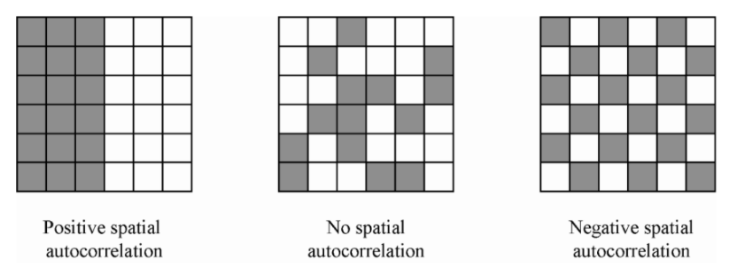

```{r setup, include=FALSE}
knitr::opts_chunk$set(echo = TRUE)
```

# Introduction 

### Moran's I Analysis for Spatial Autocorrelation

Spatial autocorrelation analysis is a powerful technique employed in geographic information science to explore and quantify the degree of spatial clustering or dispersion within a dataset. One widely used method for assessing spatial autocorrelation is Moran's I, which provides insights into the spatial distribution of a variable and the potential presence of clusters or patterns.

### Moran's I Analysis Procedure

In this tutorial, we will guide you through the steps of conducting a Moran's I analysis using R. The analysis involves the calculation of Moran's I statistic, which measures the spatial correlation between values of a variable and their spatial locations. The procedure includes the preparation of spatial data, creation of spatial weights to represent the relationships between neighboring observations, and the interpretation of Moran's I results.

### Understanding Positive and Negative Spatial Autocorrelation

Before delving into the analysis, it is crucial to understand the implications of positive and negative spatial autocorrelation.

**Positive Spatial Autocorrelation:** A positive Moran's I indicates that similar values tend to cluster together in space. This suggests the presence of spatial patterns where nearby locations share similar characteristics. Positive autocorrelation is indicative of spatial homogeneity and can reveal hotspots or clusters in your data.

**Negative Spatial Autocorrelation:** Conversely, a negative Moran's I suggests that dissimilar values are clustered together. This implies a spatial pattern of dissimilarity, where neighboring locations have contrasting characteristics. Negative autocorrelation may highlight spatial heterogeneity or dispersion in the dataset.

Understanding the sign of Moran's I is crucial for interpreting the spatial structure of your data and gaining insights into potential trends or anomalies.

{ style="display: block; margin: 0 auto" }

### Significance threshold

To assess the statistical significance of Moran's I, we will determine a significance threshold through permutation testing. Permutation testing involves comparing the observed Moran's I value to a distribution of Moran's I values obtained by randomly shuffling the values of the variable across spatial units. The significance threshold helps us determine whether the observed spatial autocorrelation is likely due to chance or if it represents a true spatial pattern.

By following this tutorial, you will not only learn how to perform Moran's I analysis but also gain the skills to interpret and visualize spatial autocorrelation patterns, providing valuable insights into the underlying spatial processes in your data.


### External references

Additional explanations and tutorials can be found here:
https://mgimond.github.io/es214_support_tutorials/moranI_distance/MoranI_distance_band.html

https://rpubs.com/laubert/SACtutorial

https://rpubs.com/quarcs-lab/spatial-autocorrelation

# Demonstration

In this illustration, the dataset referenced from [@PELLETIER2023113747] will serve as the foundation for our analysis. The primary objective is to assess the distance at which autocorrelation in time series covariates becomes statistically insignificant. To accomplish this, we will leverage images acquired on different days and conduct independent evaluations of autocorrelation for various indices or bands.

The specific covariates under consideration are seasonally-detrended values of moisture and vegetation-related indices, such as NMDI (Normalized Multi-band Drought Index) and NDVI (Normalized Difference Vegetation Index). Additionally, we will examine Thiel-Sen's slope values pertaining to the trend component of these decompositions. By scrutinizing these covariates, we aim to understand the spatial characteristics of autocorrelation and identify the critical distance beyond which the temporal patterns exhibit no significant correlation.

Through this analysis, we intend to unravel the intricate spatial dynamics inherent in the provided dataset and glean insights into the temporal dependencies of the selected covariates. The utilization of multiple indices and Thiel-Sen's slope values enhances the robustness of our evaluation, allowing for a comprehensive understanding of the autocorrelation patterns present in the temporal evolution of moisture and vegetation-related variables. 

### Prerequisites

Before starting, make sure you have the following R packages installed:
```{r message=FALSE, warning=FALSE}
library(sf)
library(ggplot2)
library(dplyr)
library(spdep)
library(data.table)
library(caret)
library(ranger)
library(lubridate)
library(reshape2)
library(foreach)
library(parallel)
library(doParallel)
```

### Data preparation

Define the working directory for this project
```{r}
main.dir<- "C://Users//pelletierni//OneDrive - AGR-AGR//Documents//MoranI//"
```


Load your spatial data into R.
```{r eval=FALSE, include=TRUE}
# Read the CSV file into a data.table
df2 <- fread(paste0(main.dir,"training_dataset_Jan2023.csv"))

# Read the burned shapefile and select relevant columns
burned.shp <- st_read(paste0(main.dir,"shapefiles//probablePeatland_Greater0pt25sqkm_intersectNBACsince2017_pts_SJ_NBAC2.shp")) 
burned.shp <- burned.shp %>% 
  dplyr::select(filename, geometry)

# Read the unburned shapefile, create a filename, and select relevant columns
unburned.shp <- st_read(paste0(main.dir,"shapefiles//probablePeatland_Greater0pt25sqkm_neverburned_3268pts.shp")) 
unburned.shp <- unburned.shp %>% 
  mutate(filename = paste0("unburned_peatland_", CID)) %>%
  dplyr::select(filename, geometry)

# Combine burned and unburned shapefiles
sites.all <- rbind(unburned.shp, burned.shp) 

# Rename the 'filename' column to 'site'
sites.all <- sites.all %>% 
  rename(site = filename)

# Plot the unburned shapefile
plot(unburned.shp)
```

Typically, a Moran's I analysis operates on neighboring (adjacent) features. However, we have the flexibility to customize this approach by redefining neighboring features to include those intersecting an annulus with a progressively expanding radius. This forms the foundation of our analysis, where Moran's calculations will be conducted for points considered as "neighbors," with the concept of adjacency evolving as we incrementally enlarge the radius.

The random permutation part to obtain the significance of Moran's I is automated within the *moran.mc* function. More details on this function can be found in the spdep package documentation (https://www.rdocumentation.org/packages/spdep/versions/1.2-8/topics/moran.mc).

```{r eval=FALSE, include=TRUE}
# Define dates and metrics that will be evaluated
dates.all <- c("2021-05-22", "2021-06-19", "2021-07-17", "2021-09-11", "2022-05-22", "2022-06-19", "2022-07-17", "2022-09-11")
metrics.all <- c("wetness_slope6", "wetness_trend4", "mean_vh_slope3", "mean_vh_trend4", "NMDI_trend4", "brightness_trend4", "mean")

# Define a list of variables to export to parallel processes
varList <- c("df2", "sites.all", "dates.all", "metrics.all")

# Set up parallel processing
n_clust <- detectCores()
cl <- makeCluster(n_clust - 4)
clusterExport(cl, varlist = varList)
registerDoParallel(cl)

# We use the foreach function to run the loops in parallel processing, this significantly improves the runtime as wqe can have multiple tasks running on different cores at the same time
out <- foreach(k = 1:4, .combine = 'rbind') %:%
  foreach(j = 1:7, .combine = 'rbind') %dopar% {
    metric_on <- metrics.all[k]
    date_on <- dates.all[j]

    # Subset the data based on the selected date
    df.sub <- df2 %>% filter(date == date_on)

    # Merge with spatial data
    df.sp <- merge(sites.all, df.sub, by = "site")
    s.coord <- st_coordinates(df.sp)

    # Define distance bands (annuli)
    start <- 1000  # Starting distance in meters
    end <- 1000000  # Ending distance in meters
    incr <- 10000  # Distance increment (annulus width)
    incr.v <- seq(start, end, incr)

    # Initialize empty vectors to store results
    morI.mc <- vector()
    sign.mc <- vector()

    # Extract the variable of interest
    data.test <- df.sp %>% pull(metric_on)

    # Loop the Moran's Analaysis through each distance band
    for (i in (2:length(incr.v))) {
      s.dist <- dnearneigh(s.coord, incr.v[i - 1], incr.v[i])
      s.lw <- nb2listw(s.dist, style = "W", zero.policy = TRUE)
      s.mor <- moran.mc(data.test, s.lw, nsim = 599, zero.policy = TRUE)
      sign.mc[i] <- s.mor$p.value
      morI.mc[i] <- s.mor$statistic
    }

    # Modify p-value to reflect extremes at each end
    sign.mc <- ifelse(sign.mc > 0.5, 1 - sign.mc, sign.mc)
    
    # final dataframe to export
    data.frame(
      metric = metric_on,
      date = date_on,
      distance = incr.v,
      moran = morI.mc,
      p.value = sign.mc
    )
  }

# Stop parallel processing
stopCluster(cl)

# Write the output to a CSV file
write.csv(out, paste0(main.dir,"MoranI_test_Nov2023.csv"), row.names = FALSE)
```

```{r include=FALSE}
out<-read.csv(paste0(main.dir,"MoranI_test_Nov2023.csv"))
```

You can incorporate this code chunk within the foreach loop to generate detailed plots for each iteration, capturing the combinations of dates and covariates. It produces visually appealing plots. However, for the sake of avoiding a complete rerun, I have excluded it from the current execution.

```{r eval=FALSE, include=TRUE}
# First, generate an empty plot
plot(morI.mc ~ eval(incr.v - incr * 0.5), type = "n", ann = FALSE, axes = FALSE)

# Set the background plot to grey then add white grids
u <- par("usr") # Get plot are coordinates
rect(u[1], u[3], u[2], u[4], col = "#EEEEEE", border = NA)
axis(1, lab = ((incr.v) / 1000), at = (incr.v), tck = 1, col = "#FFFFFF", lty = 1)
axis(2, tck = 1, col = "#FFFFFF", lty = 1, labels = FALSE)

# Add the theoretical "no autocorelation" line
abline(h = -1 / (length(df.sp$wetness_slope6)), col = "grey20")

# Add the plot to the canvas
par(new = TRUE)
plot(morI.mc ~ eval(incr.v - incr * 0.5),
     type = "b", xaxt = "n", las = 1,
     xlab = "Distance (km)", ylab = "Moran's I")
points(morI.mc ~ eval(incr.v - incr * 0.5), 
       col = ifelse(sign.mc < 0.01, "red", "grey"), 
       pch = 16, cex = 2.0)

# Add numeric values to points
text(eval(incr.v - incr * 0.5), morI.mc, round(sign.mc,3), pos = 3, cex = 0.5)
```
### Plot the results by date and by covariates:

```{r message=FALSE, warning=FALSE}
out<- out %>% mutate(sign=ifelse(p.value<0.01,"yes","no"))

plot.x<-ggplot(data=na.omit(out),aes(x=distance/1000,y=moran,color=date))+geom_line()+
  #geom_point()+
  xlab("distance treshold (km)")+
  ylab("Moran I's")+
  theme_bw()+
  geom_hline(yintercept = 0)+
  facet_wrap(~metric,scales="free")+
  scale_colour_viridis_d()

ggsave(plot.x,
       filename="C://Users//Lion//Documents//TimeSeries_Peatland//Moran I//Moran_plot_Nov2023.jpg",
       width=10,
       height=7,
       units = "in")
print(plot.x)
```

# Conclusion

We can discern from this analysis that, on most days, the covariates we intend to incorporate into our model exhibit spatial autocorrelation up to a substantial distance of about 500 km—an observation of considerable magnitude. Additionally, it is evident that runs from the same years yield more analogous curves. In this context, the extensive range of spatial autocorrelation can be explained by the fact that we are examining the same type of land cover (forested peatlands) and employing seasonal detrending to eliminate noise and seasonality from the time series. The results strongly indicate that the resulting covariates represent large-scale drought or vegetation patterns.

The actions you take with this information will heavily depend on your analysis goals and the type of model you aim to run, if modeling is your objective. In this particular scenario, we utilized Random Forest and Gradient Boosting to predict fire likelihood. The training of these models is not necessarily influenced by spatial and temporal autocorrelation, though it can be important in certain contexts. Nonetheless, model validation should undoubtedly account for spatial and temporal autocorrelation by implementing a block-bootstrapping approach for cross-validation. The parameters crucial for this block-bootstrapping approach would be the size of the blocks, both in time and space. Hence, our Moran's I analysis suggests that employing blocks of 500 x 500 km and temporal bootstrapping may necessitate holding out an entire year of data at a time.

# References
